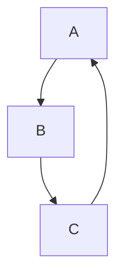

# Markdown Comprehensive Test File

## 1. Headings

# Heading H1
## Heading H2
### Heading H3
#### Heading H4
##### Heading H5
###### Heading H6

---

## 2. Emphasis & Text

**Bold Text**  
*Italic Text*  
***Bold & Italic***  
~~Strikethrough~~  
Normal paragraph text.

---

## 3. Links

[GitHub Markdown Cheatsheet](https://github.com/lifeparticle/Markdown-Cheatsheet)
[Markdown Guide](https://www.markdownguide.org/)

See full cheat sheet: [Markdown Guide Ref][mdguide]

[mdguide]: https://www.markdownguide.org/ "Markdown Guide"

Raw URL: https://github.com

---

## 4. Images & Media


<video controls width="320">
  <source src="https://interactive-examples.mdn.mozilla.net/media/cc0-videos/flower.mp4" type="video/mp4">
</video>

<audio controls>
  <source src="https://interactive-examples.mdn.mozilla.net/media/examples/t-rex-roar.mp3" type="audio/mpeg">
</audio>

---

## 5. Lists & Tasks

- Unordered item 1
- Unordered item 2
  - Nested item

1. Ordered item one
2. Ordered item two

- [x] Task completed
- [ ] Task not completed

---

## 6. Blockquotes

> This is a blockquote
> > Nested blockquote

---

## 7. Code

```bash
echo "Hello, World"
```

```python
print("Markdown Tests")
```

```javascript
console.log("Hello from JS");
```

```html
<div class="test">HTML block</div>
```

```json
{
  "name": "example",
  "value": 123
}
```

```latex
\[
E = mc^2
\]
```



---

## 8. Tables

| Left | Center | Right |
|:-----|:------:|------:|
| L1   | C1     | R1    |
| L2   | C2     | R2    |

---

## 9. LaTeX Math

Inline: $a^2 + b^2 = c^2$

$$
\int_0^\infty e^{-x} dx = 1
$$

---

## 10. HTML Elements

<div style="background:#f6f8fa;padding:5px">
This section uses an inline HTML container
</div>

<details>
<summary>Click to expand</summary>
Hidden content revealed.
</details>

---

## 11. Footnotes

Here is a sentence with a footnote.[^1]

[^1]: This is the footnote content.

---

## 12. Emoji

Happy face 😊
GitHub icon: :octocat:

---

## 13. Internal Link

[Jump to Tables](#8-tables)

---

## 14. Horizontal Rules

---
***
___

---

## 15. Escaping Characters

\*Literal asterisk\*  
\# Not a heading

---

## 16. GitHub References

Issue example: https://github.com/lifeparticle/Markdown-Cheatsheet/issues/1
PR example: https://github.com/lifeparticle/Markdown-Cheatsheet/pull/10

---

## 17. Checklist

- [ ] Test vectors
- [ ] Media playback
- [ ] Table alignment

